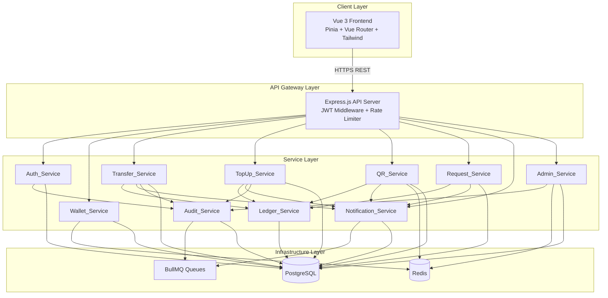
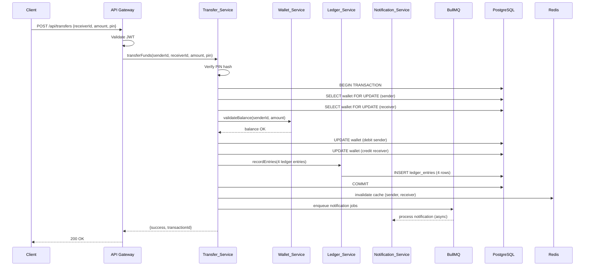
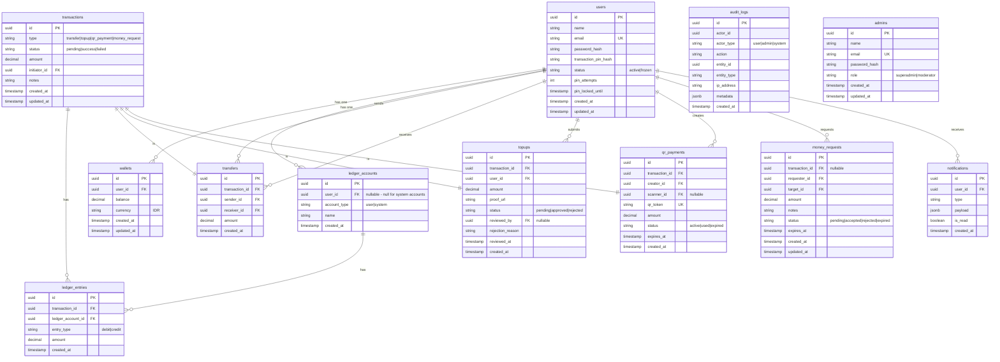

# Design Document: DezPay E-Wallet

## Overview

DezPay adalah aplikasi e-wallet berbasis web yang mensimulasikan dompet digital modern dengan fitur-fitur utama: registrasi & autentikasi pengguna, manajemen saldo, transfer antar pengguna, top up saldo, pembayaran QR Code, request money, notifikasi real-time, dan panel admin.

Sistem dirancang dengan prinsip **separation of concerns** — setiap domain bisnis dienkapsulasi dalam service tersendiri yang berkomunikasi melalui interface yang terdefinisi dengan baik. Keandalan data keuangan dijamin melalui **double-entry bookkeeping** dan **database transactions dengan row-level locking**. Performa dijaga melalui **Redis caching** dan **asynchronous queue processing** dengan BullMQ.

### Tujuan Desain

- **Correctness**: Setiap mutasi saldo harus atomik dan konsisten; tidak boleh ada saldo negatif atau dana yang hilang.
- **Security**: Autentikasi berbasis JWT, otorisasi berbasis role, PIN transaksi ter-hash, dan audit trail lengkap.
- **Performance**: Response time < 500ms pada beban normal; caching agresif untuk data yang sering dibaca.
- **Observability**: Audit log append-only, structured logging, dan dokumentasi API via Swagger.
- **Maintainability**: Arsitektur layered yang jelas, kode terdokumentasi, dan test coverage yang memadai.

### Tech Stack

| Layer | Teknologi |
|---|---|
| Frontend | Vue 3, Pinia, Vue Router, Tailwind CSS |
| Backend | Node.js, Express.js |
| Database | PostgreSQL |
| Caching | Redis |
| Queue | BullMQ (berbasis Redis) |
| Containerization | Docker, Docker Compose |
| API Docs | Swagger (OpenAPI 3.0) |
| Deployment | Railway / VPS |

---

## Architecture

### High-Level Architecture



### Request Flow: Transfer Saldo



### Layered Architecture (Backend)

```
src/
├── routes/          # Express route definitions (thin layer)
├── controllers/     # Request/response handling, input validation
├── services/        # Business logic (Auth, Wallet, Transfer, etc.)
├── repositories/    # Database access layer (SQL queries)
├── middleware/       # JWT auth, rate limiting, error handling
├── queues/          # BullMQ job definitions & processors
├── utils/           # Helpers: hashing, JWT, validators
├── config/          # DB, Redis, env configuration
└── swagger/         # OpenAPI spec definitions
```

---

## Components and Interfaces

### Auth_Service

Bertanggung jawab atas registrasi, login, manajemen sesi, dan keamanan PIN transaksi.

```
Interface Auth_Service {
  register(name, email, password): Promise<{user, token}>
  login(email, password): Promise<{user, token}>
  logout(userId, token): Promise<void>
  changePassword(userId, oldPassword, newPassword): Promise<void>
  createTransactionPin(userId, pin): Promise<void>
  verifyTransactionPin(userId, pin): Promise<boolean>
  changeTransactionPin(userId, oldPin, newPin, password): Promise<void>
  validateToken(token): Promise<{userId, role}>
  revokeAllSessions(userId): Promise<void>
}
```

**Keputusan Desain:**
- Sesi aktif disimpan di Redis sebagai `session:{userId}:{tokenId}` dengan TTL 24 jam. Saat logout atau ganti password, semua key sesi user dihapus — ini memungkinkan revokasi instan meski JWT belum expired.
- PIN transaksi di-hash dengan bcrypt (cost factor 10) dan disimpan di tabel `users`.
- Percobaan PIN yang salah dilacak di Redis dengan key `pin_attempts:{userId}`, auto-expire 30 menit.

### Wallet_Service

Mengelola saldo dompet dan riwayat transaksi.

```
Interface Wallet_Service {
  getBalance(userId): Promise<{balance, currency}>
  getTransactionHistory(userId, page, limit): Promise<{transactions, total}>
  getLedgerEntries(userId, page, limit): Promise<{entries, total}>
  validateSufficientBalance(userId, amount): Promise<boolean>
  debitWallet(userId, amount, txId, pgClient): Promise<void>
  creditWallet(userId, amount, txId, pgClient): Promise<void>
}
```

**Keputusan Desain:**
- `debitWallet` dan `creditWallet` menerima `pgClient` (koneksi PostgreSQL yang sedang dalam transaksi) agar operasi saldo selalu atomik dengan operasi lain dalam transaksi yang sama.
- Saldo di-cache di Redis dengan key `balance:{userId}` dan TTL 60 detik. Cache di-invalidate setiap kali ada mutasi saldo.
- `SELECT ... FOR UPDATE` digunakan pada baris wallet untuk mencegah race condition pada concurrent transfers.

### Transfer_Service

Menangani transfer saldo antar pengguna.

```
Interface Transfer_Service {
  initiateTransfer(senderId, receiverId, amount, pin): Promise<Transfer>
  getTransferStatus(transferId): Promise<Transfer>
  getTransferHistory(userId, page, limit): Promise<{transfers, total}>
}
```

### TopUp_Service

Menangani pengajuan dan persetujuan top up saldo.

```
Interface TopUp_Service {
  submitTopUp(userId, amount, proofUrl): Promise<TopUp>
  approveTopUp(adminId, topUpId): Promise<TopUp>
  rejectTopUp(adminId, topUpId, reason): Promise<TopUp>
  getTopUpHistory(userId, page, limit): Promise<{topups, total}>
  getAllPendingTopUps(page, limit): Promise<{topups, total}>
}
```

### QR_Service

Menangani pembuatan dan pemrosesan pembayaran QR Code.

```
Interface QR_Service {
  generateQRCode(userId, amount): Promise<{qrToken, qrImageUrl, expiresAt}>
  processQRPayment(scannerId, qrToken, pin): Promise<QRPayment>
  getQRStatus(qrToken): Promise<QRPayment>
}
```

**Keputusan Desain:**
- Token QR disimpan di Redis dengan key `qr:{token}` dan TTL 900 detik (15 menit). Validasi kedaluwarsa dilakukan dari Redis — jika key tidak ada, QR dianggap expired (HTTP 410).
- Setelah digunakan, token di-mark sebagai `used` di database dan dihapus dari Redis untuk mencegah double-spend.

### Request_Service

Menangani permintaan uang antar pengguna.

```
Interface Request_Service {
  createMoneyRequest(requesterId, targetId, amount, note): Promise<MoneyRequest>
  approveMoneyRequest(targetId, requestId, pin): Promise<MoneyRequest>
  rejectMoneyRequest(targetId, requestId): Promise<MoneyRequest>
  getMoneyRequests(userId, type, page, limit): Promise<{requests, total}>
  expireStaleRequests(): Promise<number>  // dipanggil oleh cron job
}
```

**Keputusan Desain:**
- Expiry 72 jam diimplementasikan sebagai BullMQ delayed job yang dijadwalkan saat Money_Request dibuat. Jika request di-approve/reject sebelum expired, job dibatalkan.

### Notification_Service

Mengelola notifikasi pengguna melalui queue.

```
Interface Notification_Service {
  createNotification(userId, type, payload): Promise<void>  // enqueue ke BullMQ
  getNotifications(userId, page, limit): Promise<{notifications, total}>
  markAsRead(userId, notificationId): Promise<void>
  markAllAsRead(userId): Promise<void>
}
```

### Ledger_Service

Mencatat transaksi menggunakan double-entry bookkeeping.

```
Interface Ledger_Service {
  recordTransferEntries(txId, senderId, receiverId, amount, pgClient): Promise<void>
  recordTopUpEntries(txId, userId, amount, pgClient): Promise<void>
  recordQRPaymentEntries(txId, payerId, payeeId, amount, pgClient): Promise<void>
  getLedgerEntriesByTransaction(txId): Promise<LedgerEntry[]>
  getAccountBalance(ledgerAccountId): Promise<number>
}
```

**Keputusan Desain:**
- Setiap `record*Entries` menerima `pgClient` yang sedang dalam transaksi aktif, memastikan ledger entries dan mutasi saldo selalu committed atau rolled back bersama-sama (Requirement 9.4).

### Audit_Service

Mencatat audit log secara asinkron.

```
Interface Audit_Service {
  log(actorId, actorType, action, entityId, entityType, ipAddress, metadata): Promise<void>
  getAuditLogs(filters, page, limit): Promise<{logs, total}>
}
```

**Keputusan Desain:**
- `log()` hanya meng-enqueue job ke BullMQ dan langsung return — tidak memblokir operasi utama.
- Tabel `audit_logs` tidak memiliki operasi UPDATE atau DELETE; hanya INSERT yang diizinkan (append-only).

### Admin_Service

Menyediakan fungsionalitas manajemen platform untuk admin.

```
Interface Admin_Service {
  listUsers(search, page, limit): Promise<{users, total}>
  getUserDetail(userId): Promise<UserDetail>
  freezeAccount(adminId, userId): Promise<void>
  unfreezeAccount(adminId, userId): Promise<void>
  listAllTransactions(filters, page, limit): Promise<{transactions, total}>
  getTransactionDetail(txId): Promise<TransactionDetail>
  getPlatformStats(): Promise<PlatformStats>
}
```

### Queue_Service (BullMQ)

Mendefinisikan antrian dan processor untuk pekerjaan asinkron.

```
Queues:
  - notification-queue: Memproses pembuatan notifikasi
  - audit-queue: Memproses pencatatan audit log
  - money-request-expiry-queue: Memproses expiry Money_Request (delayed jobs)

Job Processors:
  - NotificationProcessor: INSERT ke tabel notifications
  - AuditProcessor: INSERT ke tabel audit_logs
  - MoneyRequestExpiryProcessor: UPDATE status Money_Request menjadi 'expired'
```

---

## Data Models

### Entity Relationship Diagram



### Catatan Penting Data Model

**Tabel `transactions`** berfungsi sebagai parent record untuk semua jenis transaksi keuangan. Setiap transfer, topup, qr_payment, dan money_request yang berhasil memiliki satu baris di `transactions`. Ini memudahkan query lintas tipe transaksi dan menjadi foreign key untuk `ledger_entries`.

**Tabel `ledger_accounts`** memiliki dua jenis akun:
- `user` accounts: satu per pengguna, `user_id` diisi
- `system` accounts: akun perantara untuk transfer (e.g., "System Transit Account"), `user_id` null

**Double-entry untuk transfer**: Setiap transfer menghasilkan 4 ledger entries:
1. DEBIT akun pengirim (saldo berkurang)
2. CREDIT akun sistem transit (saldo bertambah)
3. DEBIT akun sistem transit (saldo berkurang)
4. CREDIT akun penerima (saldo bertambah)

**Indeks Database yang Diperlukan:**
```sql
-- Performance indexes
CREATE INDEX idx_wallets_user_id ON wallets(user_id);
CREATE INDEX idx_transactions_initiator_id ON transactions(initiator_id);
CREATE INDEX idx_transactions_type_status ON transactions(type, status);
CREATE INDEX idx_transactions_created_at ON transactions(created_at DESC);
CREATE INDEX idx_ledger_entries_transaction_id ON ledger_entries(transaction_id);
CREATE INDEX idx_ledger_entries_account_id ON ledger_entries(ledger_account_id);
CREATE INDEX idx_transfers_sender_id ON transfers(sender_id);
CREATE INDEX idx_transfers_receiver_id ON transfers(receiver_id);
CREATE INDEX idx_topups_user_id ON topups(user_id);
CREATE INDEX idx_topups_status ON topups(status);
CREATE INDEX idx_qr_payments_qr_token ON qr_payments(qr_token);
CREATE INDEX idx_money_requests_requester_id ON money_requests(requester_id);
CREATE INDEX idx_money_requests_target_id ON money_requests(target_id);
CREATE INDEX idx_notifications_user_id_created ON notifications(user_id, created_at DESC);
CREATE INDEX idx_audit_logs_actor_id ON audit_logs(actor_id);
CREATE INDEX idx_audit_logs_action ON audit_logs(action);
CREATE INDEX idx_audit_logs_created_at ON audit_logs(created_at DESC);
```

---

## Correctness Properties

*A property is a characteristic or behavior that should hold true across all valid executions of a system — essentially, a formal statement about what the system should do. Properties serve as the bridge between human-readable specifications and machine-verifiable correctness guarantees.*

### Property 1: Registrasi Membuat Akun dan Wallet dengan Saldo Nol

*For any* kombinasi nama, email, dan password yang valid, operasi registrasi SHALL selalu menghasilkan akun User baru dan Wallet dengan saldo awal tepat nol (0) dalam mata uang IDR.

**Validates: Requirements 1.1**

---

### Property 2: Duplikasi Email Selalu Ditolak

*For any* email yang sudah terdaftar di sistem, percobaan registrasi ulang dengan email yang sama SHALL selalu mengembalikan HTTP 409, terlepas dari data lain yang dikirimkan.

**Validates: Requirements 1.2**

---

### Property 3: Validasi Panjang Password

*For any* string password, registrasi SHALL ditolak dengan HTTP 400 jika panjang string < 8 karakter, dan SHALL diterima jika panjang string >= 8 karakter.

**Validates: Requirements 1.5**

---

### Property 4: Validasi Format Email

*For any* string yang bukan merupakan format email yang valid (tidak mengandung `@` dan domain yang valid), registrasi SHALL ditolak dengan HTTP 400.

**Validates: Requirements 1.6**

---

### Property 5: Kredensial Tersimpan dalam Bentuk Hash

*For any* password atau Transaction PIN yang dikirimkan oleh pengguna, nilai yang tersimpan di database SHALL tidak sama dengan plaintext aslinya, dan `bcrypt.compare(plaintext, stored_hash)` SHALL mengembalikan `true`.

**Validates: Requirements 1.3, 13.4**

---

### Property 6: Login Berhasil Menghasilkan JWT 24 Jam

*For any* pengguna terdaftar dengan status `active`, login dengan email dan password yang benar SHALL selalu menghasilkan JWT yang valid dengan masa berlaku tepat 24 jam dari waktu penerbitan.

**Validates: Requirements 2.1**

---

### Property 7: Kredensial Salah Selalu Ditolak

*For any* kombinasi email/password yang tidak cocok dengan data di database, percobaan login SHALL selalu mengembalikan HTTP 401 tanpa memberikan informasi tentang field mana yang salah.

**Validates: Requirements 2.2**

---

### Property 8: Revokasi Sesi Setelah Logout

*For any* pengguna yang telah melakukan logout, semua token JWT yang diterbitkan sebelum logout tersebut SHALL ditolak pada setiap permintaan berikutnya, meskipun token tersebut belum melewati masa berlakunya.

**Validates: Requirements 2.3, 2.4**

---

### Property 9: Ganti Password Membatalkan Semua Sesi

*For any* pengguna yang berhasil mengganti password, semua token JWT yang diterbitkan sebelum perubahan password tersebut SHALL ditolak pada setiap permintaan berikutnya.

**Validates: Requirements 2.5**

---

### Property 10: Akun Frozen Selalu Ditolak Login

*For any* akun dengan status `frozen`, setiap percobaan login SHALL selalu mengembalikan HTTP 403, terlepas dari kebenaran kredensial yang dikirimkan.

**Validates: Requirements 2.6, 11.4**

---

### Property 11: Saldo Wallet Tidak Pernah Negatif

*For any* operasi debit pada Wallet, jika jumlah yang didebit melebihi saldo yang tersedia, operasi SHALL gagal dan saldo Wallet SHALL tetap tidak berubah. Saldo Wallet SHALL selalu bernilai >= 0 setelah setiap operasi.

**Validates: Requirements 3.3, 4.2, 6.6, 7.4**

---

### Property 12: Riwayat Transaksi Terurut Descending

*For any* pengguna dengan lebih dari satu transaksi, hasil query riwayat transaksi SHALL selalu terurut berdasarkan `created_at` secara descending (terbaru di atas), dan pagination SHALL mengembalikan jumlah item yang tepat sesuai parameter `limit`.

**Validates: Requirements 3.2**

---

### Property 13: Atomicity Mutasi Saldo

*For any* operasi keuangan yang gagal di tengah eksekusi (setelah debit pengirim tetapi sebelum kredit penerima), saldo kedua pihak SHALL kembali ke nilai sebelum operasi dimulai (rollback), sehingga tidak ada dana yang hilang atau tercipta.

**Validates: Requirements 3.4, 9.4**

---

### Property 14: Konservasi Dana pada Transfer

*For any* transfer yang berhasil antara pengirim dan penerima dengan jumlah `amount`, nilai `sender_balance_after == sender_balance_before - amount` dan `receiver_balance_after == receiver_balance_before + amount` SHALL selalu terpenuhi.

**Validates: Requirements 4.1**

---

### Property 15: PIN Salah Tidak Memproses Transfer

*For any* permintaan transfer dengan Transaction PIN yang tidak cocok dengan hash yang tersimpan, transfer SHALL tidak diproses, saldo kedua pihak SHALL tidak berubah, dan respons SHALL selalu HTTP 401.

**Validates: Requirements 4.3**

---

### Property 16: Invariant Double-Entry Bookkeeping

*For any* transaksi keuangan yang berhasil dicatat oleh Ledger_Service, jumlah total semua Ledger_Entry bertipe `debit` SHALL selalu sama dengan jumlah total semua Ledger_Entry bertipe `kredit` untuk transaksi tersebut.

**Validates: Requirements 9.1, 4.5**

---

### Property 17: Kelengkapan Atribut Ledger Entry

*For any* Ledger_Entry yang dibuat, semua atribut wajib (`transaction_id`, `ledger_account_id`, `entry_type`, `amount`, `created_at`) SHALL selalu ada, tidak null, dan bernilai valid.

**Validates: Requirements 9.3**

---

### Property 18: Konsistensi Saldo Akun Ledger

*For any* akun ledger, nilai saldo yang dihitung oleh `getAccountBalance()` SHALL selalu sama dengan `SUM(amount WHERE entry_type='credit') - SUM(amount WHERE entry_type='debit')` dari seluruh Ledger_Entry yang terkait dengan akun tersebut.

**Validates: Requirements 9.5**

---

### Property 19: Validasi Rentang Jumlah Top Up

*For any* pengajuan top up dengan jumlah `amount`, pengajuan SHALL ditolak jika `amount < 10000` atau `amount > 10000000`, dan SHALL diterima jika `10000 <= amount <= 10000000`.

**Validates: Requirements 5.6**

---

### Property 20: Approval Top Up Menambah Saldo Secara Tepat

*For any* pengajuan top up dengan status `pending` yang di-approve oleh admin, saldo Wallet pengguna SHALL bertambah sebesar nilai `amount` yang tercantum pada pengajuan tersebut, dan status top up SHALL berubah menjadi `approved`.

**Validates: Requirements 5.2**

---

### Property 21: Rejection Top Up Tidak Mengubah Saldo

*For any* pengajuan top up dengan status `pending` yang di-reject oleh admin, saldo Wallet pengguna SHALL tidak berubah, dan status top up SHALL berubah menjadi `rejected`.

**Validates: Requirements 5.3**

---

### Property 22: Token QR Unik dan Berlaku 15 Menit

*For any* permintaan pembuatan QR Code, token yang dihasilkan SHALL unik (tidak ada token yang sama di sistem), dan waktu kedaluwarsa SHALL tepat 15 menit dari waktu pembuatan.

**Validates: Requirements 6.1**

---

### Property 23: QR Expired Selalu Ditolak

*For any* token QR yang telah melewati waktu kedaluwarsanya (> 15 menit dari pembuatan), setiap percobaan pembayaran SHALL selalu mengembalikan HTTP 410, terlepas dari kondisi lain.

**Validates: Requirements 6.3**

---

### Property 24: QR Idempotency — Tidak Bisa Digunakan Dua Kali

*For any* token QR yang sudah berhasil digunakan untuk pembayaran, setiap percobaan pembayaran berikutnya dengan token yang sama SHALL selalu mengembalikan HTTP 409 dan tidak memproses pembayaran.

**Validates: Requirements 6.4**

---

### Property 25: Pengguna Tanpa PIN Tidak Bisa Bertransaksi

*For any* pengguna yang belum membuat Transaction PIN, setiap permintaan ke Transfer_Service, QR_Service, atau Request_Service SHALL selalu mengembalikan HTTP 403 yang menginstruksikan pembuatan PIN.

**Validates: Requirements 13.1, 13.5**

---

### Property 26: Blokir Transaksi Setelah 5 Kali PIN Salah

*For any* pengguna yang telah memasukkan Transaction PIN yang salah sebanyak 5 kali atau lebih secara berturut-turut, semua percobaan transaksi keuangan berikutnya SHALL ditolak selama 30 menit sejak percobaan ke-5 yang salah.

**Validates: Requirements 13.2**

---

### Property 27: Perubahan PIN Memerlukan Verifikasi Ganda

*For any* permintaan perubahan Transaction PIN, perubahan SHALL ditolak jika PIN lama tidak cocok ATAU jika password akun tidak cocok. Perubahan hanya SHALL diizinkan jika kedua verifikasi berhasil.

**Validates: Requirements 13.3**

---

### Property 28: Money Request Expired Setelah 72 Jam

*For any* Money_Request dengan status `pending` yang telah melewati 72 jam sejak pembuatan tanpa respons dari target, status SHALL berubah menjadi `expired`.

**Validates: Requirements 7.6**

---

### Property 29: Notifikasi Money Request Mengandung Data Lengkap

*For any* notifikasi yang dibuat untuk Money_Request baru, payload notifikasi SHALL selalu mengandung nama pemohon dan jumlah yang diminta.

**Validates: Requirements 8.3**

---

### Property 30: Notifikasi Terurut Descending

*For any* pengguna dengan lebih dari satu notifikasi, hasil query daftar notifikasi SHALL selalu terurut berdasarkan `created_at` secara descending, dan pagination SHALL mengembalikan jumlah item yang tepat.

**Validates: Requirements 8.5**

---

### Property 31: Mark As Read Mengubah Status Notifikasi

*For any* notifikasi dengan status `unread`, setelah operasi mark-as-read berhasil, status notifikasi tersebut SHALL berubah menjadi `read` dan tidak dapat kembali ke `unread`.

**Validates: Requirements 8.6**

---

### Property 32: Audit Log Append-Only

*For any* Audit_Log yang telah dibuat, tidak ada operasi UPDATE atau DELETE yang SHALL berhasil dieksekusi pada baris tersebut. Setiap percobaan modifikasi SHALL gagal.

**Validates: Requirements 10.3**

---

### Property 33: Kelengkapan Atribut Audit Log

*For any* Audit_Log yang dibuat, semua atribut wajib (`actor_id`, `actor_type`, `action`, `entity_id`, `entity_type`, `ip_address`, `created_at`) SHALL selalu ada dan tidak null.

**Validates: Requirements 10.2**

---

### Property 34: Filter Audit Log Konsisten

*For any* kombinasi filter (tipe aksi, ID aktor, rentang waktu) yang diberikan pada query Audit_Log, semua hasil yang dikembalikan SHALL memenuhi semua kriteria filter yang diberikan, dan tidak ada hasil yang melanggar kriteria filter tersebut.

**Validates: Requirements 10.4**

---

### Property 35: Filter Transaksi Admin Konsisten

*For any* kombinasi filter (tipe transaksi, status, rentang waktu, ID user) yang diberikan pada query transaksi admin, semua hasil yang dikembalikan SHALL memenuhi semua kriteria filter yang diberikan.

**Validates: Requirements 12.1**

---

### Property 36: Fallback ke PostgreSQL Saat Redis Tidak Tersedia

*For any* permintaan data saldo atau statistik ketika Redis tidak tersedia, sistem SHALL mengembalikan data yang valid dari PostgreSQL tanpa mengembalikan error kepada pengguna.

**Validates: Requirements 14.3**

---

### Property 37: Konservasi Dana pada Concurrent Transfers

*For any* set operasi transfer yang dieksekusi secara konkuren, jumlah total saldo seluruh Wallet di sistem SHALL sama sebelum dan sesudah semua operasi selesai (tidak ada dana yang tercipta atau hilang akibat race condition).

**Validates: Requirements 14.5**

---

## Error Handling

### Strategi Error Handling Global

Semua error ditangani oleh middleware `errorHandler` di Express yang menghasilkan respons JSON yang konsisten:

```json
{
  "success": false,
  "error": {
    "code": "ERROR_CODE",
    "message": "Pesan error yang dapat dibaca manusia",
    "details": {}
  }
}
```

### Kode HTTP dan Kondisi Error

| HTTP Code | Kondisi | Contoh |
|---|---|---|
| 400 | Validasi input gagal | Password < 8 karakter, format email invalid |
| 401 | Autentikasi gagal | JWT tidak valid, PIN salah |
| 403 | Otorisasi gagal | Akun frozen, belum buat PIN |
| 404 | Resource tidak ditemukan | User ID tidak ada, Transfer ID tidak ada |
| 409 | Konflik state | Email sudah terdaftar, QR sudah digunakan |
| 410 | Resource sudah tidak berlaku | QR Code expired |
| 422 | Kondisi bisnis tidak terpenuhi | Saldo tidak cukup, jumlah top up di luar range |
| 429 | Rate limit terlampaui | Terlalu banyak request |
| 500 | Error internal server | Database connection error, unexpected exception |

### Error Handling per Service

**Auth_Service:**
- JWT expired atau invalid → 401 dengan pesan generik (tidak mengungkap detail)
- Akun frozen → 403 dengan pesan eksplisit
- PIN locked → 403 dengan informasi waktu unlock

**Transfer_Service / QR_Service / Request_Service:**
- User belum buat PIN → 403 dengan instruksi membuat PIN
- PIN salah → 401, increment counter, lock jika >= 5
- Saldo tidak cukup → 422 dengan saldo saat ini (tanpa mengungkap saldo penerima)

**Database Errors:**
- Connection timeout → retry 3x dengan exponential backoff, lalu 503
- Deadlock → retry otomatis oleh PostgreSQL driver
- Constraint violation → 409 atau 422 tergantung konteks

**Queue Errors (BullMQ):**
- Job gagal → log error, hapus dari queue (no retry untuk notifikasi per Requirement 8.7)
- Queue tidak tersedia → operasi utama tetap berjalan, audit log gap diterima (Requirement 10.5)

**Redis Errors:**
- Connection error → fallback ke PostgreSQL, log warning (Requirement 14.3)
- Cache miss → query PostgreSQL, populate cache

### Logging

- **HTTP 500 errors**: Log dengan stack trace lengkap ke sistem log (Requirement 15.4)
- **HTTP 4xx errors**: Log tanpa stack trace (hanya request info dan error message)
- **Queue job failures**: Log dengan job data dan error message
- **Format**: Structured JSON logging dengan fields: `timestamp`, `level`, `service`, `requestId`, `userId`, `message`, `error`

---

## Testing Strategy

### Pendekatan Pengujian

DezPay menggunakan pendekatan **dual testing**: unit/property tests untuk logika bisnis, dan integration tests untuk verifikasi infrastruktur dan end-to-end flows.

### Tech Stack Testing

| Layer | Library |
|---|---|
| Unit & Property Tests | **Jest** + **fast-check** (property-based testing) |
| Integration Tests | **Supertest** + Jest |
| Database Tests | **testcontainers** (PostgreSQL container) |
| Coverage | Jest coverage (target: 80%+) |

### Property-Based Tests (fast-check)

Setiap Correctness Property di atas diimplementasikan sebagai satu property-based test menggunakan `fast-check`. Konfigurasi minimum:

```javascript
// Contoh: Property 14 - Konservasi Dana pada Transfer
test('Property 14: Transfer conserves total funds', () => {
  fc.assert(
    fc.asyncProperty(
      fc.record({
        senderBalance: fc.integer({ min: 10000, max: 10000000 }),
        amount: fc.integer({ min: 1000, max: 5000000 }),
      }),
      async ({ senderBalance, amount }) => {
        fc.pre(amount <= senderBalance); // precondition: sufficient balance
        // ... setup, execute, assert
      }
    ),
    { numRuns: 100 } // minimum 100 iterasi
  );
});
```

**Tag format untuk setiap property test:**
```javascript
// Feature: dezpay-ewallet, Property 14: Transfer conserves total funds
```

### Unit Tests

Fokus pada:
- Validasi input (email format, password length, amount range)
- Business logic murni (PIN hashing, JWT generation, balance calculation)
- Error conditions spesifik (404, 409, dll.)
- Edge cases yang tidak tercakup property tests

### Integration Tests

Fokus pada:
- Redis cache hit/miss behavior (Requirements 3.5, 14.2)
- BullMQ job enqueue dan processing (Requirements 8.1, 10.5)
- Database transaction rollback pada failure nyata
- End-to-end flows: register → login → transfer → check balance
- Admin flows: list users → freeze → verify login rejected

### Smoke Tests

- `GET /api/docs` mengembalikan 200 dengan Swagger UI
- Semua environment variables terkonfigurasi dengan benar
- Database connection berhasil saat startup
- Redis connection berhasil saat startup

### Test Coverage Targets

| Service | Unit/Property | Integration |
|---|---|---|
| Auth_Service | 90%+ | Login/logout/freeze flows |
| Wallet_Service | 85%+ | Balance cache fallback |
| Transfer_Service | 90%+ | Concurrent transfer safety |
| TopUp_Service | 85%+ | Approve/reject flows |
| QR_Service | 90%+ | Expiry dan idempotency |
| Request_Service | 85%+ | Expiry job |
| Ledger_Service | 95%+ | Double-entry invariant |
| Audit_Service | 80%+ | Append-only enforcement |

### Menjalankan Tests

```bash
# Unit dan property tests (single run)
npx jest --runInBand

# Integration tests (memerlukan Docker)
npx jest --testPathPattern=integration --runInBand

# Coverage report
npx jest --coverage
```

---
